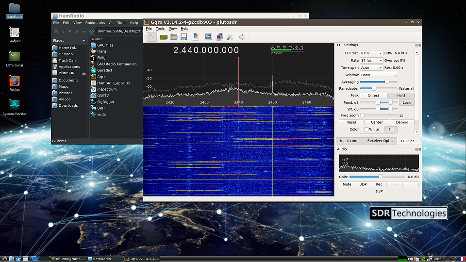

# NanoSDR

NanoSDR is a ready to use distribution for NVIDIA Jetson Nano 2G and 4G dedicated to amateur radio applications.
It is based on a Ubuntu 18.04 root filesystem and LXDE desktop and comes with several popular apps compiled for the Nano (see details below).

SDR-Technologies develops different SDR products based on NVIDIA embedded GPU and we have worked on this distribution to estimate the processing capabilities of these  "small" processors. Originally for internal use, the team (mainly licensed amateurs) believes this could be something useful for the community and we have decided to release the work as a set of "ready to use" SD-Cards.

The images are quite big and are hosted in a public web server, please bear in mind you are about to download several gigabytes of data before being able to play with it...

The files are provided "as is" and we cannot commit to release regular updates, but we will continue to improve it and maybe offer here scripts to update/add new features to the existing image.

Feel free to use the "Github issues" features to suggest improvements.



## Download link

Download image corresponding to your Jetson-Nano.  
Take care to use adequate image since hardware is not the same for Nano-2GB and nano 4GB models.

* Image for Jetson Nano 2GB : http://download.sdr-technologies.fr/nano/jetson-nano-hamradio-2GB.zip  
(md5 : 42add6780e5d7e7b904746b9b237db8a, sha1sum :  4332f6b2282b56c5a201fec00b2973cc7e97e717 )  

* Image for Jetson Nano 4GB : http://download.sdr-technologies.fr/nano/jetson-nano-hamradio-4GB.zip  
 (md5 : 3641810a0b4e16b7cd63e3a45fc39818, sha1sum : 923d667a73c071f89a468505f8267ba3d4831b75 )  

## Default user
Default user is `ubuntu` , default password : `ubuntu`  
First boot is longer than usual since the Nano needs to recreate SSH keys, and expand filesystem partition to maximum available size.  
Once session is opened feel free to change locale settings and keyboard mapping.  
Pre-installed languages/keyboards : english-US, french, german, spanish.  

## Installed applications

### Introduction
Most of installed applications are supporting SoapySDR.
However only RTLSDR and PlutoSDR support have been deeply tested.  
Feel free to install SoapySDR module corresponding to your device if not yet installed.

### Development suite
* Gcc 7 and 8
* Cuda Toolkit version 10.2
* Boost, Volk, ....
* Git , CMake, Qt 5

#### SoapySDR
Current version installed on NanoSDR is v0.8  
Supported modules are : BladeRF, plutoSDR, RTLSDR, SDRPlay, Airspy, SoapyRemote

```
######################################################
##     Soapy SDR -- the SDR abstraction library     ##
######################################################

Lib Version: v0.8.0-g926c86d9
API Version: v0.8.0
ABI Version: v0.8
Install root: /usr/local
Search path:  /usr/local/lib/SoapySDR/modules0.8
Module found: /usr/local/lib/SoapySDR/modules0.8/libPlutoSDRSupport.so (0.2.0-6e2ae74)
Module found: /usr/local/lib/SoapySDR/modules0.8/libairspySupport.so   (0.1.2-10d697b)
Module found: /usr/local/lib/SoapySDR/modules0.8/libbladeRFSupport.so  (0.4.1-1c1e8aa)
Module found: /usr/local/lib/SoapySDR/modules0.8/libremoteSupport.so   (0.6.0-c09b2f1)
Module found: /usr/local/lib/SoapySDR/modules0.8/librtlsdrSupport.so   (0.3.1-bec4f05)
Module found: /usr/local/lib/SoapySDR/modules0.8/libsdrPlaySupport.so  (0.3.0-8c4e330)
Available factories... airspy, bladerf, plutosdr, remote, rtlsdr, sdrplay
....
```

#### GNUradio 3.8.2
This version was installed and compiled using PPA sources, gr-iio module (PlutoSDR support) is also installed.  

#### osmocom & gr-osmocom 
- built-in source types: osmosdr rtl uhd plutosdr miri rfspace soapy redpitaya spyserver    

Specific compilation with plutoSDR and Spyserver client  
https://github.com/dk2ro/gr-osmosdr-pluto-spyserver

Please note that osmocom is not really maintened, hopefully some forks are working well.  

Spyserver client might crash GQRX if incorrect samplerate is set.  

#### GQRX 2.14.2-4
This is the latest version compiled from sources : https://github.com/csete/gqrx
 
#### SigDigger
https://github.com/BatchDrake/SigDigger

#### Inspectrum
https://github.com/miek/inspectrum

#### URH
https://github.com/jopohl/urh

#### QSSTV  
QSSTV has been installed from Ubuntu repository, since sources are not available.

#### WS-JTX 2.2.2
Compiled from sources available here: https://physics.princeton.edu/pulsar/k1jt/wsjtx-2.2.2.tgz

#### LuaRadio 0.8
LuaRadio can be used to rapidly prototype software radio applications, modulation/demodulation utilities, and signal processing experiments. It can also be embedded into existing radio applications to serve as a user scriptable engine for signal processing. LuaRadio is very similar to GNUradio using blocks, sources, sinks, except it use scripts (no GUI).  

Very nice and functional examples are provided on the website &github for RTLSDR device, can be easily adapted to other devices.
Website : https://luaradio.io  

#### RTLSDR_Airband
https://github.com/szpajder/RTLSDR-Airband/

Compiled with following specific options : `PLATFORM= armv8-generic make NFM=1 PULSE=1 WITH_RTLSDR=1 WITH_SOAPYSDR=1` 
Default configuration file is : /usr/local/etc/rtl_airband.conf  
To use your own configuration file use -c parameter followed by full path to your customized config file.  

#### FFMPEG (GPU acceleration)
https://github.com/jocover/jetson-ffmpeg  
This is a full version of FFMPEG including all available supported formats.
Please report to the author's repository for GPU-accelerated decoders/encoders use.
Since it relies on GPU hardware for acceleration, you have to run it as `sudo` user.

#### multimon-ng 1.1.8
https://github.com/EliasOenal/multimon-ng

#### rtl_433 (soapy support)
https://github.com/merbanan/rtl_433

For PlutoSDR run : `rtl_433 -d plutosdr ....`

#### rx_tools (soapy)
https://github.com/rxseger/rx_tools

#### tx_sdr
Tool for transmitting data to SDRs, based on rtl_sdr from librtlsdr, and rx_sdr from rx_tools, using the SoapySDR vendor-neutral SDR support library, intended to support a wide range of TX-capable devices.  
https://github.com/triq-org/tx_tools

This tool has not been tested due to lack of time ...  

#### dump1090 (/usr/bin/readsb)
https://github.com/Mictronics/readsb  
Note : original executable "dump1090" as been renamed by the author. Use `readsb` command instead.

For plutoSDR use :  ` dump1090 --device-type plutosdr`

#### Conda installer
Conda installer for arm64 platforms comes from conda-forge : https://github.com/conda-forge/miniforge/releases/download/4.9.2-3/Miniforge-pypy3-Linux-aarch64.sh
On the jetson nano, installation path is located in /opt directory.

## Thank you !  
First, thanks to the authors of those nice SDR applications !  

Thank you for giving your time testing the nanoSDR image and providing suggestions and ideas:
- F4GKR - Twitter : @sylvain_azarian
- F5OEO - Twitter : @F5OEOEvariste
- F5OZP 
- LamaBleu - Twitter : @fonera_cork


